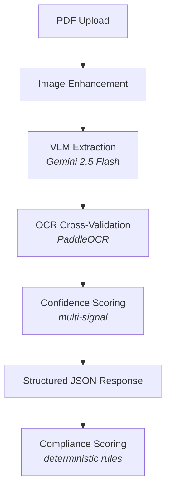

<div align="center">
  
  
  # 🧠 DocMind AI

  **Next-Generation Hybrid Document Intelligence System**

  *Combining VLM (Vision-Language Model) and OCR-based structured extraction with deterministic compliance scoring for logistics document processing and customs compliance automation.*

  <p align="center">
    <a href="https://python.org"></a>
    <a href="https://fastapi.tiangolo.com/"></a>
    <a href="https://react.dev/"></a>
    <a href="https://postgresql.org"></a>
    <a href="https://docker.com"></a>
    <a href="https://aistudio.google.com/"></a>
  </p>
</div>

---

## 📋 Table of Contents

- [✨ Architecture Overview](#-architecture-overview)
- [🛠️ Tech Stack](#️-tech-stack)
- [🚀 Quick Start](#-quick-start)
- [🔌 API Endpoints](#-api-endpoints)
- [📂 Project Structure](#-project-structure)
- [🗺️ Roadmap](#️-roadmap)
- [💡 Framework Choice](#-framework-choice)
- [📚 Key Documents](#-key-documents)

---

## ✨ Architecture Overview



### 🎯 Key Architectural Decisions

- **VLM-First Extraction**: Gemini 2.5 Flash processes document images directly, understanding layout and tables natively — unlike traditional OCR→LLM pipelines that lose spatial context.
- **Multi-Signal Confidence**: Each field's confidence combines VLM self-assessment, OCR cross-validation, format validation, and business rule checks.
- **Deterministic Compliance**: The model extracts data; pure Python code scores it. *Same input = same score, always.*
- **4-Layer JSON Repair**: The API always returns valid JSON, even when the model's output is malformed.

---

## 🛠️ Tech Stack

| Component | Choice | Why |
| :--- | :--- | :--- |
| **Backend** | `FastAPI` | Async, Pydantic-native, auto-docs |
| **VLM** | `Gemini 2.5 Flash` | Best cost/accuracy for document vision |
| **OCR** | `PaddleOCR` | Best open-source OCR for degraded scans |
| **Vision** | `OpenCV + PyMuPDF` | Robust preprocessing pipeline |
| **Validation** | `Pydantic v2` | Schema enforcement + serialization |
| **Logging** | `structlog` | Production JSON logging |

---

## 🚀 Quick Start

### ⚙️ Prerequisites
- **Python 3.12+** (Or use Docker)
- **Gemini API key** ([Get one here](https://aistudio.google.com/apikey))

### 💻 Local Setup

```bash
# 1. Clone and enter project
git clone https://github.com/Mohammedkh97/DocMind-AI.git
cd DocMind-AI

# 2. Create virtual environment
python -m venv venv
source venv/bin/activate  # Windows: venv\Scripts\activate

# 3. Install dependencies
pip install -r backend/requirements.txt

# 4. Configure environment
cd backend
cp .env.example .env
# 📝 Edit .env and add your GEMINI_API_KEY and other keys

# 5. Run the server
uvicorn main:app --reload
```

### 🐳 Docker Setup

> **Note:** The easiest way to get up and running without dependency issues!

```bash
# Copy env file and add your API key
cd backend
cp .env.example .env

# Build and run the entire stack
cd ..
docker compose up --build
```
> The API will be available at `http://localhost:8000`.<br>
> Check out the **Interactive API documentation** at `http://localhost:8000/docs`.

---

## 🔌 API Endpoints

<details>
<summary><b>🟢 <code>POST /extract</code></b> - Extract structured data from a scanned logistics PDF</summary>

**Request:**
```bash
curl -X POST "http://localhost:8000/extract" \
  -H "Content-Type: multipart/form-data" \
  -F "file=@path/to/document.pdf"
```

**Response:**
```json
{
  "invoice": {
    "invoice_number": { "value": "CRG-INV-2024-0087", "confidence": 0.97 },
    "invoice_date": { "value": "March 14, 2024", "confidence": 0.95 },
    "seller": { "name": { "value": "ShanghaiTex Co. Ltd", "confidence": 0.96 } },
    "subtotal": { "value": 13680.0, "confidence": 0.95 }
  },
  "metadata": {
    "processing_time_seconds": 4.2,
    "primary_model": "gemini-2.5-flash"
  }
}
```
</details>

<details>
<summary><b>🔵 <code>POST /compliance-score</code></b> - Score extracted data against compliance rules</summary>

**Request:**
```bash
curl -X POST "http://localhost:8000/compliance-score" \
  -H "Content-Type: application/json" \
  -d @extracted_data.json
```

**Response:**
```json
{
  "score": 62,
  "grade": "D",
  "total_issues": 5,
  "critical_issues": 2,
  "summary": "Document scored 62/100 (Grade: D). 2 critical issue(s) found requiring immediate attention."
}
```
</details>

<details>
<summary><b>⚪ <code>GET /health</code></b> - Health check endpoint</summary>

```bash
curl http://localhost:8000/health
```
</details>

---

## 🧪 Testing the API

### 🌐 Swagger UI (Recommended)
FastAPI automatically generates an interactive Swagger UI. This is the easiest way to test the endpoints!
1. Start the backend server (`uvicorn main:app --reload` or via Docker).
2. Open your browser and go to: [http://localhost:8000/docs](http://localhost:8000/docs)
3. **To test `/extract`**: Click on the **`POST /extract`** endpoint, click **"Try it out"**, upload your PDF, and hit **"Execute"**. You can then copy the JSON response block.
4. **To test `/compliance-score`**: Click on the **`POST /compliance-score`** endpoint, click **"Try it out"**, paste the JSON response you got from `/extract` into the Request body box, and hit **"Execute"**.

### 📮 Postman
**Testing `/extract`**:
1. Create a new **POST** request to `http://localhost:8000/extract`.
2. Go to the **Body** tab and select **form-data**.
3. Add a new key named `file`, change its type from *Text* to *File* (by hovering over the key cell), and select your PDF document.
4. Hit **Send**! (Save the JSON output for the next step).

**Testing `/compliance-score`**:
1. Create a new **POST** request to `http://localhost:8000/compliance-score`.
2. Go to the **Body** tab, select **raw**, and change the format dropdown from *Text* to **JSON**.
3. Paste the full JSON response you got from the `/extract` endpoint into the text area.
4. Hit **Send**!

---

## 📂 Project Structure

```text
DocMind-AI/
├── ARCHITECTURE.md                      # Architecture decisions (6 questions)
├── RUBRIC.md                            # Compliance scoring rules
├── docker-compose.yml                   # One-command setup
├── README.md                            # Project documentation
│
├── backend/                             # FastAPI Backend
│   ├── main.py                          # FastAPI application entry point
│   ├── Dockerfile                       # Container definition
│   ├── requirements.txt                 # Python dependencies
│   ├── .env.example                     # Environment template
│   │
│   ├── api/                             # API Layer
│   │   ├── routers/                     # Extract and compliance routes
│   │   ├── middleware.py                # Request tracking, error handling
│   │   └── dependencies.py              # Dependency injection
│   │
│   ├── core/                            # Core Infrastructure
│   │   ├── config.py                    # Pydantic BaseSettings
│   │   ├── exceptions.py                # Custom exception hierarchy
│   │   └── logging.py                   # Structured JSON logging
│   │
│   ├── schemas/                         # Data Contracts (Pydantic Models)
│   ├── services/                        # Business Logic (Extraction, Compliance)
│   ├── prompts/                         # Extraction Prompts
│   ├── tests/                           # Tests
│   ├── assets/                          # Input images and documents
│   └── outputs/                         # 🗂️ Note: Created automatically after starting processing files
│
├── frontend/                            # ⚛️ React Frontend Application
│
└── Agentic Document Extractor/          # 🤖 Agentic extraction concepts and experiments
```

---

## 🗺️ Roadmap

- 🚀 **Next Feature / Idea:** Developing an **Agentic Document Extractor**. This will involve exploring autonomous agent-based workflows for more complex document understanding, extraction, and reasoning tasks.

---

## 💡 Framework Choice

**Why FastAPI over Flask, Django, or Express.js?**

1. ⚡ **Native Pydantic integration**: The entire response schema is defined in Pydantic models. FastAPI auto-generates OpenAPI docs from these, making the API self-documenting.
2. 🔄 **Async support**: VLM and OCR calls are I/O bound. Async handlers prevent blocking while waiting for model responses.
3. 🛡️ **Built-in validation**: Request validation, file upload handling, and error responses come free.
4. 📈 **Industry standard for ML APIs**: Most production ML services use FastAPI, ensuring immediate familiarity for reviewers and contributors.

---

## 📚 Key Documents

- 📐 **[ARCHITECTURE.md](./ARCHITECTURE.md)** — Answers to the 6 architecture questions
- 📏 **[RUBRIC.md](./RUBRIC.md)** — Compliance scoring rules and methodology

<br>

<p align="center">
  Built with ❤️ using Python, FastAPI, Gemini, PaddleOCR, React, and Docker.
</p>

---

## 📬 Contact

<p align="center">
  <a href="https://linkedin.com/in/mohammed-khalaf97"></a>
  &nbsp;
  <a href="https://github.com/mohammedkh97"></a>
</p>
