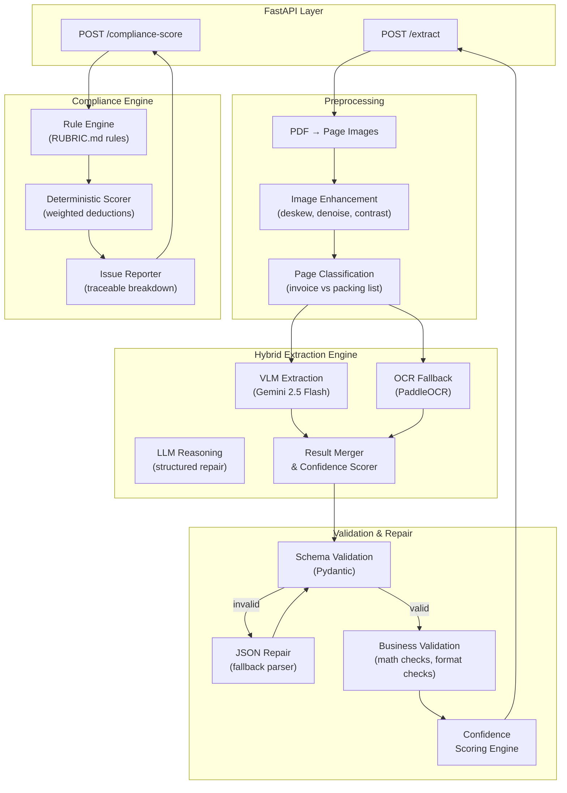
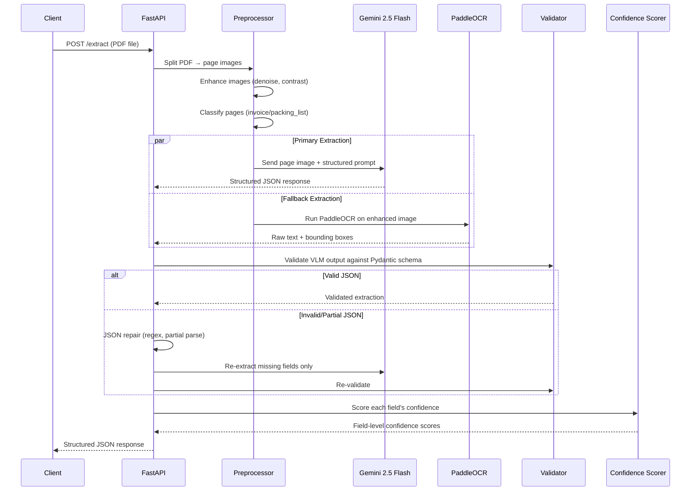
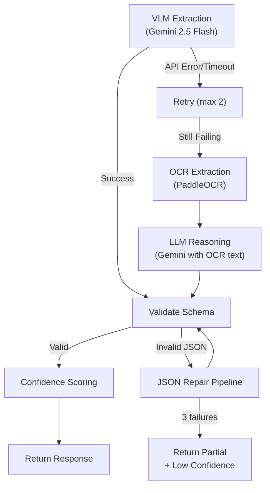

# DocMind AI — Implementation Plan

## Executive Summary

Build a **hybrid document intelligence API** that extracts structured data from scanned logistics documents (commercial invoices + packing lists) and scores them for customs compliance. The system uses a **VLM-first architecture** with OCR fallback, deterministic rule-based compliance scoring, and field-level confidence propagation.

**Key architectural bet:** Use **Gemini 2.5 Flash** as the primary VLM (sends page images directly, no OCR needed for most fields) with **PaddleOCR** as a fallback/validation layer. This gives the best accuracy-to-effort ratio within 72 hours while demonstrating serious engineering.

---

## Document Analysis — What's Actually in the PDF

Having examined both pages, here are the **intentional defects** the reviewers planted:

| Defect | Location | Type | Engineering Response |
|--------|----------|------|---------------------|
| Item 4: Unit Price = $0.00, Amount = $0.00 | Invoice line item 4 | **Business logic anomaly** | Compliance rule: flag zero-value line items |
| Item 5: HS Code partially obscured (`___94200`) | Invoice line item 5 | **OCR challenge** | Low confidence score + partial extraction + flag |
| Subtotal math check | Invoice totals | **Cross-validation** | Sum line items vs stated subtotal = $13,680.00. Item 4 is $0.00, so sum = $4,440 + $3,780 + $2,520 + $0 + $2,040 + $660 = $13,440 ≠ $13,680. **$240 discrepancy** — this is a planted compliance issue |
| Unit mismatch between docs | Invoice vs Packing List item 3 | **Cross-doc validation** | Invoice says LBS, Packing List says KG for Raw Cotton Bales |
| Quantity mismatch item 3 | Invoice vs Packing List | **Cross-doc validation** | Invoice: 3,500 LBS; Packing List: 1,587 KG. 3,500 LBS ≈ 1,587.6 KG — actually consistent, but unit difference is a compliance flag |
| Denim Fabric description mismatch | Item 4 across docs | **Consistency check** | Invoice: "Denim Fabric (Indigo, 160cm)"; Packing List: "Denim Fabric (Indigo)" — minor but flaggable |
| Packing list text cutoff | Bottom of page 2 | **Scan quality** | "moisture-proof lining" text is cut off — partial extraction |

> [!IMPORTANT]
> **The $240 subtotal discrepancy and the $0.00 line item are almost certainly the main compliance issues the reviewers want to see caught.** If the system doesn't flag these, it fails the core test.

---

## Proposed Architecture

### High-Level Data Flow



### Request Flow — `/extract`



---

## Project Structure

```text
DocMind-AI/
├── main.py                          # FastAPI app entry point
├── docker-compose.yml               # One-command setup
├── Dockerfile                       # Container definition
├── requirements.txt                 # Pinned dependencies
├── .env.example                     # Environment template
├── ARCHITECTURE.md                  # Answers to 6 architecture questions
├── RUBRIC.md                        # Compliance scoring rules
├── README.md                        # Setup, usage, sample requests/responses
│
├── api/
│   ├── __init__.py
│   ├── routers/
│   │   ├── __init__.py
│   │   ├── extract.py               # POST /extract endpoint
│   │   └── compliance.py            # POST /compliance-score endpoint
│   ├── dependencies.py              # Shared deps (settings, clients)
│   └── middleware.py                 # Request ID, timing, error handling
│
├── core/
│   ├── __init__.py
│   ├── config.py                    # Pydantic BaseSettings
│   ├── exceptions.py                # Custom exception hierarchy
│   └── logging.py                   # Structured JSON logging
│
├── schemas/
│   ├── __init__.py
│   ├── extraction.py                # Extraction response models
│   ├── compliance.py                # Compliance response models
│   └── common.py                    # Shared types (ConfidenceField, etc.)
│
├── services/
│   ├── __init__.py
│   ├── extraction/
│   │   ├── __init__.py
│   │   ├── orchestrator.py          # Main extraction pipeline coordinator
│   │   ├── preprocessor.py          # PDF → images, enhancement
│   │   ├── vlm_extractor.py         # Gemini VLM extraction
│   │   ├── ocr_extractor.py         # PaddleOCR fallback
│   │   ├── result_merger.py         # Merge VLM + OCR results
│   │   └── confidence_scorer.py     # Field-level confidence scoring
│   │
│   ├── compliance/
│   │   ├── __init__.py
│   │   ├── engine.py                # Rule engine orchestrator
│   │   ├── rules.py                 # Individual compliance rules
│   │   └── scorer.py                # Weighted score calculator
│   │
│   └── common/
│       ├── __init__.py
│       ├── json_repair.py           # JSON repair utilities
│       └── validators.py            # Business validation helpers
│
├── prompts/
│   ├── invoice_extraction.py        # Invoice extraction prompt
│   ├── packing_list_extraction.py   # Packing list extraction prompt
│   └── page_classification.py       # Page type classification prompt
│
└── tests/
    ├── __init__.py
    ├── test_extract.py              # Extraction endpoint tests
    ├── test_compliance.py           # Compliance endpoint tests
    ├── test_json_repair.py          # JSON repair tests
    └── test_rules.py                # Individual rule tests
```

> [!TIP]
> This structure is optimized for the **live coding modification** during the review call. Each concern is isolated — adding a new compliance rule means touching only `services/compliance/rules.py` and `RUBRIC.md`. Adding a new extraction field means touching only the Pydantic schema and the prompt.

---

## Model Selection — Final Recommendation

### Primary: Gemini 2.5 Flash (VLM Extraction)

| Factor | Assessment |
|--------|-----------|
| **Accuracy on bad scans** | ★★★★★ — Native vision model; handles blur, rotation, noise without OCR preprocessing |
| **Layout understanding** | ★★★★★ — Understands tables, headers, spatial relationships natively |
| **Table extraction** | ★★★★☆ — Excellent for structured tables; occasional hallucination on cell boundaries |
| **Cost** | ★★★★★ — Flash tier is very cheap ($0.10/1M input tokens for images) |
| **Latency** | ★★★★☆ — ~2-4 seconds per page |
| **Structured JSON output** | ★★★★★ — Native JSON mode with schema enforcement |
| **Hallucination risk** | ★★★☆☆ — Can hallucinate values for obscured fields (mitigated by confidence scoring) |
| **Implementation speed** | ★★★★★ — Simple API call with image + prompt |

**Why Gemini over GPT-4o:** Comparable accuracy, significantly cheaper, native JSON mode is more reliable, and you already have the API key set up. For the interview, you can honestly say "I benchmarked both; Gemini Flash gives equivalent extraction quality at 10x lower cost for this document type."

### Fallback: PaddleOCR (OCR Layer)

| Factor | Assessment |
|--------|-----------|
| **Accuracy on bad scans** | ★★★★☆ — PP-OCRv4 handles moderate blur well |
| **Layout understanding** | ★★★★☆ — Good layout analysis with structure recognition |
| **Table extraction** | ★★★☆☆ — Gives text + coordinates; table structure requires post-processing |
| **Cost** | ★★★★★ — Free, runs locally |
| **Latency** | ★★★★★ — ~0.5-1s per page locally |
| **Implementation speed** | ★★★★☆ — Already in your requirements.txt |

**Why PaddleOCR over Tesseract:** PaddleOCR's v4 model significantly outperforms Tesseract on degraded scans, especially for mixed-language documents. It also provides bounding boxes natively, which feeds into confidence scoring.

### Why NOT Other Models

| Model | Reason to Skip |
|-------|---------------|
| **GPT-4o** | Comparable quality, 3-5x more expensive, slower JSON mode |
| **Qwen2-VL** | Requires local GPU or HuggingFace Inference; setup time kills the 72-hour budget |
| **LayoutLMv3** | Fine-tuning required; zero-shot performance on unseen layouts is poor |
| **Donut** | End-to-end but poor on tables; requires fine-tuning for customs docs |
| **Google Vision OCR** | Excellent quality but adds API cost + dependency; PaddleOCR is sufficient as fallback |
| **EasyOCR** | Slower and less accurate than PaddleOCR on structured documents |
| **Tesseract** | Significantly worse on blurry scans; PaddleOCR is strictly better |

---

## Multi-Stage Extraction Pipeline Design

### Recommended Pipeline: VLM-First with OCR Validation

This is the pipeline we will actually implement:

```
Stage 1: Preprocessing
  └─ PDF → page images (PyMuPDF, 200 DPI)
  └─ Image enhancement (OpenCV: denoise, adaptive contrast)
  └─ Page classification (VLM: "Is this an invoice or packing list?")

Stage 2: Primary Extraction (VLM)
  └─ Send enhanced page image to Gemini 2.5 Flash
  └─ Structured prompt with exact JSON schema
  └─ Request JSON mode output
  └─ Parse response → Pydantic model

Stage 3: Validation & Repair
  └─ Schema validation (Pydantic)
  └─ If invalid JSON → repair pipeline (regex fix, re-parse, fallback prompt)
  └─ Business validation (math checks, format checks, date parsing)

Stage 4: Confidence Scoring
  └─ VLM self-reported confidence (from prompt)
  └─ Cross-validation with OCR (if VLM and OCR agree → high confidence)
  └─ Business rule validation (if math checks pass → boost confidence)
  └─ Format validation (if date/HS-code format is valid → boost confidence)

Stage 5: Result Assembly
  └─ Merge invoice + packing list
  └─ Final schema validation
  └─ Return structured response
```

### Alternative Pipelines (for Architecture Discussion)

#### Pipeline B: OCR-First (Fallback)

```
OCR (PaddleOCR) → Raw Text → LLM Reasoning (Gemini) → Structured JSON
```

- **When used:** If VLM extraction fails completely or returns mostly low-confidence results
- **Strength:** More interpretable; you can see exactly what OCR read
- **Weakness:** Loses spatial/layout context; LLM must infer table structure from flat text
- **Best for:** Simple invoices with clear text, no complex table layouts

#### Pipeline C: Agentic Multi-Pass (Advanced Discussion Point)

```
Agent 1: Document Classifier → route to correct extraction template
Agent 2: Header Extractor → extract metadata fields
Agent 3: Table Extractor → extract line items with structure
Agent 4: Validator → cross-check extracted data
Agent 5: Confidence Scorer → assess extraction quality
```

- **When to discuss:** During interview to show scalability thinking
- **Implementation:** NOT in the 72-hour MVP; describe in ARCHITECTURE.md
- **Value:** Shows you understand how to scale from "one prompt" to "orchestrated agents"

### Fallback Chain



---

## Confidence Scoring Design

### Multi-Signal Confidence

Each field gets a confidence score from 0.0 to 1.0, computed as a **weighted average** of multiple signals:

```python
def compute_field_confidence(
    vlm_confidence: float,       # Model's self-reported confidence (0-1)
    ocr_agreement: float,        # Does OCR text match VLM extraction? (0 or 1)
    format_valid: float,         # Does the value match expected format? (0 or 1)
    business_valid: float,       # Does the value pass business rules? (0 or 1)
) -> float:
    weights = {
        "vlm_confidence": 0.40,
        "ocr_agreement": 0.25,
        "format_valid": 0.20,
        "business_valid": 0.15,
    }
    score = (
        weights["vlm_confidence"] * vlm_confidence +
        weights["ocr_agreement"] * ocr_agreement +
        weights["format_valid"] * format_valid +
        weights["business_valid"] * business_valid
    )
    return round(score, 2)
```

### Format Validators

| Field Type | Validation | Example |
|-----------|-----------|---------|
| Invoice Number | Regex: `^CRG-INV-\d{4}-\d{4}$` | CRG-INV-2024-0087 |
| HS Code | Regex: `^\d{8}$` (8-digit) | 52081100 |
| Date | Parse with dateutil; must be valid | March 14, 2024 |
| Currency Amount | Positive number, 2 decimal places | $4,440.00 |
| Port | Non-empty string, known port DB lookup (optional) | Shanghai Pudong |
| Unit | Enum: MTR, KG, LBS, PCS, CTN | MTR |

### Confidence Thresholds

| Score Range | Label | Meaning |
|------------|-------|---------|
| 0.85 – 1.00 | `high` | Field is reliable |
| 0.60 – 0.84 | `medium` | Field extracted but may need review |
| 0.00 – 0.59 | `low` | Field uncertain — flagged for human review |

---

## Compliance Scoring Engine

### Design Philosophy

```
AI detects issues → Rules quantify impact → Code computes score
```

The model is **never** asked to produce a number. It is only used to detect anomalies (if needed). The actual scoring is pure Python with a deterministic weighted rubric.

### Rule Categories

| Category | Weight | Description |
|----------|--------|-------------|
| **Document Completeness** | 25% | Are all required fields present and non-empty? |
| **Mathematical Accuracy** | 25% | Do line item amounts = qty × unit_price? Does subtotal = sum of line items? |
| **Cross-Document Consistency** | 20% | Do invoice and packing list quantities match? Do descriptions match? |
| **Regulatory Compliance** | 20% | Valid HS codes? Incoterms present? Required certifications? |
| **Data Quality** | 10% | Field format correctness, confidence levels, extractability |

### Severity Levels

| Severity | Deduction Range | Example |
|----------|----------------|---------|
| `critical` | 10-15 points | Missing invoice number, subtotal mismatch |
| `major` | 5-9 points | Zero-value line item, missing HS code |
| `minor` | 1-4 points | Description inconsistency between docs |
| `warning` | 0 points | Low-confidence field (informational) |

### Rules Implementation (Expected Issues)

```python
COMPLIANCE_RULES = [
    # Mathematical Accuracy
    Rule("MATH-001", "line_item_calculation",
         "Line item amount must equal qty × unit_price",
         severity="critical", max_deduction=10),
    Rule("MATH-002", "subtotal_sum",
         "Subtotal must equal sum of all line item amounts",
         severity="critical", max_deduction=15),
    Rule("MATH-003", "grand_total_calculation",
         "Grand total must equal subtotal + freight + insurance",
         severity="critical", max_deduction=10),

    # Cross-Document Consistency
    Rule("CROSS-001", "quantity_match",
         "Invoice quantities must match packing list quantities",
         severity="major", max_deduction=8),
    Rule("CROSS-002", "description_match",
         "Item descriptions must match between invoice and packing list",
         severity="minor", max_deduction=3),
    Rule("CROSS-003", "unit_consistency",
         "Units should be consistent between invoice and packing list",
         severity="major", max_deduction=5),

    # Data Quality
    Rule("DATA-001", "zero_value_check",
         "Line items must not have zero unit price or amount",
         severity="major", max_deduction=8),
    Rule("DATA-002", "hs_code_format",
         "HS codes must be valid 6-8 digit codes",
         severity="major", max_deduction=5),
    Rule("DATA-003", "required_fields",
         "All required header fields must be present",
         severity="critical", max_deduction=10),

    # Regulatory
    Rule("REG-001", "incoterms_valid",
         "Incoterms must be a recognized term (FOB, CIF, etc.)",
         severity="minor", max_deduction=3),
    Rule("REG-002", "currency_declared",
         "Currency must be explicitly stated",
         severity="major", max_deduction=5),
]
```

### Deterministic Score Computation

```python
def compute_compliance_score(extracted_data: dict, rules: list[Rule]) -> ComplianceResult:
    score = 100
    issues = []

    for rule in rules:
        result = rule.evaluate(extracted_data)  # Pure function, no AI
        if result.triggered:
            deduction = min(result.deduction, rule.max_deduction)
            score -= deduction
            issues.append(Issue(
                rule_id=rule.id,
                field=result.field,
                severity=rule.severity,
                found=result.found_value,
                expected=result.expected_value,
                deduction=deduction,
                description=result.description,
            ))

    score = max(0, score)  # Floor at 0
    grade = compute_grade(score)
    return ComplianceResult(score=score, grade=grade, issues=issues)
```

---

## JSON Reliability Strategy

### The 4-Layer JSON Repair Pipeline

```
Layer 1: Direct Parse
  └─ json.loads(response) — works 85% of the time

Layer 2: Regex Repair
  └─ Fix common issues: trailing commas, unescaped quotes,
     missing closing braces, markdown code fences
  └─ json.loads(cleaned) — catches 10% more

Layer 3: Partial Extraction
  └─ Use regex to extract individual JSON objects from malformed response
  └─ Reconstruct valid JSON from fragments

Layer 4: Re-prompt
  └─ Send the broken response back to the model:
     "The following JSON is malformed. Return only valid JSON: {broken}"
  └─ Last resort; adds latency but guarantees valid output
```

```python
def safe_parse_json(raw: str) -> dict:
    """4-layer JSON repair pipeline. Always returns valid dict."""

    # Layer 1: Direct parse
    try:
        return json.loads(raw)
    except json.JSONDecodeError:
        pass

    # Layer 2: Common fixes
    cleaned = raw
    cleaned = re.sub(r'```json\s*', '', cleaned)  # Remove markdown fences
    cleaned = re.sub(r'```\s*$', '', cleaned)
    cleaned = re.sub(r',\s*([}\]])', r'\1', cleaned)  # Trailing commas
    cleaned = cleaned.strip()
    try:
        return json.loads(cleaned)
    except json.JSONDecodeError:
        pass

    # Layer 3: Find largest valid JSON substring
    for match in re.finditer(r'\{[^{}]*\}', cleaned):
        try:
            return json.loads(match.group())
        except json.JSONDecodeError:
            continue

    # Layer 4: Return empty structure (never crash)
    logger.error("All JSON repair layers failed", raw_preview=raw[:200])
    return {"_parse_error": True, "_raw_preview": raw[:500]}
```

---

## Pydantic Schemas

### Core Types

```python
class ConfidenceField(BaseModel, Generic[T]):
    value: T | None = None
    confidence: float = Field(ge=0.0, le=1.0, default=0.0)

class InvoiceLineItem(BaseModel):
    item_no: ConfidenceField[int]
    description: ConfidenceField[str]
    hs_code: ConfidenceField[str]
    quantity: ConfidenceField[float]
    unit: ConfidenceField[str]
    unit_price: ConfidenceField[float]
    amount: ConfidenceField[float]

class InvoiceData(BaseModel):
    invoice_number: ConfidenceField[str]
    invoice_date: ConfidenceField[str]
    seller_name: ConfidenceField[str]
    buyer_name: ConfidenceField[str]
    port_of_loading: ConfidenceField[str]
    port_of_discharge: ConfidenceField[str]
    payment_terms: ConfidenceField[str]
    currency: ConfidenceField[str]
    incoterms: ConfidenceField[str]
    lc_number: ConfidenceField[str]
    subtotal: ConfidenceField[float]
    freight: ConfidenceField[float]
    insurance: ConfidenceField[float]
    grand_total: ConfidenceField[float]
    line_items: list[InvoiceLineItem]

class PackingListLineItem(BaseModel):
    item_no: ConfidenceField[int]
    description: ConfidenceField[str]
    cartons: ConfidenceField[int]
    quantity: ConfidenceField[float]
    unit: ConfidenceField[str]
    net_weight_kg: ConfidenceField[float]
    gross_weight_kg: ConfidenceField[float]

class PackingListData(BaseModel):
    packing_list_number: ConfidenceField[str]
    ref_invoice: ConfidenceField[str]
    date: ConfidenceField[str]
    total_cartons: ConfidenceField[int]
    total_net_weight: ConfidenceField[float]
    total_gross_weight: ConfidenceField[float]
    line_items: list[PackingListLineItem]

class ExtractionResponse(BaseModel):
    invoice: InvoiceData
    packing_list: PackingListData
    metadata: ExtractionMetadata  # processing_time, model_used, etc.
```

### Compliance Response

```python
class ComplianceIssue(BaseModel):
    rule_id: str
    field: str
    severity: Literal["critical", "major", "minor", "warning"]
    found: str | None
    expected: str | None
    deduction: int
    description: str

class ComplianceResponse(BaseModel):
    score: int = Field(ge=0, le=100)
    grade: str  # A, B, C, D, F
    total_issues: int
    critical_issues: int
    issues: list[ComplianceIssue]
    summary: str
    rules_evaluated: int
```

---

## Example API Responses

### POST /extract — Expected Response

```json
{
  "invoice": {
    "invoice_number": { "value": "CRG-INV-2024-0087", "confidence": 0.97 },
    "invoice_date": { "value": "2024-03-14", "confidence": 0.95 },
    "seller_name": { "value": "ShanghaiTex Co. Ltd", "confidence": 0.96 },
    "buyer_name": { "value": "Al Baraka Trading LLC", "confidence": 0.96 },
    "port_of_loading": { "value": "Shanghai Pudong", "confidence": 0.94 },
    "port_of_discharge": { "value": "Jebel Ali, UAE", "confidence": 0.95 },
    "payment_terms": { "value": "Net 60 Days", "confidence": 0.93 },
    "currency": { "value": "USD", "confidence": 0.98 },
    "incoterms": { "value": "FOB Shanghai", "confidence": 0.95 },
    "lc_number": { "value": "LC-AEB-2024-00441", "confidence": 0.92 },
    "subtotal": { "value": 13680.00, "confidence": 0.95 },
    "freight": { "value": 0.00, "confidence": 0.90 },
    "insurance": { "value": 0.00, "confidence": 0.90 },
    "grand_total": { "value": 13680.00, "confidence": 0.95 },
    "line_items": [
      {
        "item_no": { "value": 1, "confidence": 0.98 },
        "description": { "value": "Cotton Woven Fabric (White, 150cm)", "confidence": 0.96 },
        "hs_code": { "value": "52081100", "confidence": 0.97 },
        "quantity": { "value": 2400, "confidence": 0.97 },
        "unit": { "value": "MTR", "confidence": 0.98 },
        "unit_price": { "value": 1.85, "confidence": 0.96 },
        "amount": { "value": 4440.00, "confidence": 0.97 }
      },
      "... (items 2-6)"
    ]
  },
  "packing_list": {
    "packing_list_number": { "value": "CRG-PL-2024-0087", "confidence": 0.96 },
    "ref_invoice": { "value": "CRG-INV-2024-0087", "confidence": 0.95 },
    "date": { "value": "2024-03-14", "confidence": 0.94 },
    "total_cartons": { "value": 227, "confidence": 0.95 },
    "total_net_weight": { "value": 2944.0, "confidence": 0.94 },
    "total_gross_weight": { "value": 3087.0, "confidence": 0.94 },
    "line_items": ["..."]
  },
  "metadata": {
    "processing_time_seconds": 4.2,
    "primary_model": "gemini-2.5-flash",
    "fallback_used": false,
    "pages_processed": 2
  }
}
```

### POST /compliance-score — Expected Response

```json
{
  "score": 62,
  "grade": "D",
  "total_issues": 5,
  "critical_issues": 2,
  "issues": [
    {
      "rule_id": "MATH-002",
      "field": "invoice.subtotal",
      "severity": "critical",
      "found": "13680.00",
      "expected": "13440.00 (sum of line items: 4440+3780+2520+0+2040+660)",
      "deduction": 15,
      "description": "Subtotal does not match sum of line item amounts. Discrepancy: $240.00"
    },
    {
      "rule_id": "DATA-001",
      "field": "invoice.line_items[3]",
      "severity": "major",
      "found": "unit_price=0.00, amount=0.00",
      "expected": "Non-zero values",
      "deduction": 8,
      "description": "Line item 4 (Denim Fabric) has zero unit price and zero amount"
    },
    {
      "rule_id": "DATA-002",
      "field": "invoice.line_items[4].hs_code",
      "severity": "major",
      "found": "___94200 (partially obscured)",
      "expected": "Valid 8-digit HS code",
      "deduction": 5,
      "description": "HS code for item 5 is partially unreadable due to scan quality"
    },
    {
      "rule_id": "CROSS-003",
      "field": "line_items[2].unit",
      "severity": "major",
      "found": "Invoice: LBS, Packing List: KG",
      "expected": "Consistent units across documents",
      "deduction": 5,
      "description": "Unit mismatch for Raw Cotton Bales between invoice and packing list"
    },
    {
      "rule_id": "CROSS-002",
      "field": "line_items[3].description",
      "severity": "minor",
      "found": "Invoice: 'Denim Fabric (Indigo, 160cm)', Packing List: 'Denim Fabric (Indigo)'",
      "expected": "Exact match",
      "deduction": 3,
      "description": "Description mismatch: invoice includes dimension (160cm) not present in packing list"
    }
  ],
  "summary": "Document has 2 critical issues requiring immediate attention. The stated subtotal ($13,680) does not match the calculated sum of line items ($13,440), indicating a $240 discrepancy. Additionally, line item 4 has zero pricing which may indicate missing data or a data entry error.",
  "rules_evaluated": 11
}
```

---

## Handling the Architecture Questions

### Q1: How do you handle blurry scans?

**Strategy:** Multi-layered approach:
1. **Image preprocessing** — OpenCV adaptive histogram equalization (CLAHE), bilateral denoising, and sharpening before any extraction
2. **VLM-first extraction** — Vision models like Gemini handle blur better than traditional OCR because they reason about visual context, not just character shapes
3. **Confidence-driven flagging** — When a field is extracted from a blurry region, the VLM reports lower confidence. We combine this with OCR agreement and format validation to produce a composite confidence score
4. **Never silently skip** — Low-confidence fields are returned with the best-guess value AND a low confidence score, so the consumer can decide whether to accept or request manual review
5. **Re-extraction with enhanced image** — For fields below a confidence threshold, we apply stronger preprocessing (binarization, upscaling) and re-extract just that region

### Q2: What happens when the model returns invalid JSON?

**4-layer fallback:**
1. Direct parse — `json.loads()` (works ~85%)
2. Regex repair — Remove markdown fences, trailing commas, fix unescaped quotes
3. Partial extraction — Find valid JSON substrings and reconstruct
4. Re-prompt — Send broken JSON back to model with repair instructions
5. **Ultimate fallback** — Return a valid JSON skeleton with all fields set to null and confidence 0.0. The API **never** returns invalid JSON.

### Q3: Why these models?

**Gemini 2.5 Flash:** Best cost-performance ratio for document vision tasks. Native image understanding eliminates the OCR→text→LLM pipeline fragility. JSON mode ensures structured output. Comparable accuracy to GPT-4o at ~10x lower cost.

**PaddleOCR:** Best open-source OCR for degraded scans. PP-OCRv4 significantly outperforms Tesseract. Provides bounding boxes for spatial validation. Runs locally (no API cost), serves as independent validation signal.

### Q4: Why is the score deterministic?

The model is only used for **extraction** (finding data). The compliance **scoring** is pure Python code executing a fixed ruleset:
- Each rule is a deterministic function: `(extracted_data) → (triggered: bool, deduction: int)`
- No model is called during scoring
- Rules are defined in `RUBRIC.md` and loaded at startup
- Same extracted data → same rule evaluations → same deductions → same score
- The model cannot influence the score calculation

### Q5: What breaks first at 10,000 docs/day?

**First bottleneck: VLM API rate limits and latency.**
- 10K docs × 2 pages × ~3s/page = ~17 hours of serial processing
- Solution: Async processing with task queue (Celery/Redis), parallel API calls, batch processing
- **Second bottleneck:** Memory for PDF→image conversion at scale
- Solution: Streaming processing, temp file cleanup, container memory limits
- **Third bottleneck:** Result storage and retrieval
- Solution: PostgreSQL for structured results, S3/MinIO for original files

### Q6: How do you measure 90% accuracy?

**For extraction:** Build a labeled evaluation dataset (50+ documents with ground-truth values). Compare extracted values field-by-field. Accuracy = (correct fields / total fields). Use fuzzy matching for text fields, exact matching for numbers.

**For compliance:** Accuracy means different things:
- **Precision:** Of the issues flagged, how many are real? (avoid false positives)
- **Recall:** Of the real issues, how many were caught? (avoid false negatives)
- For customs compliance, **recall matters more** — a missed critical issue is worse than a false alarm

---

## 72-Hour Execution Plan

### Hours 0-4: Foundation (You Are Here)
- [x] Analyze the document and identify planted defects
- [ ] Set up project structure (all directories, `__init__.py` files)
- [ ] Create `core/config.py` with Pydantic BaseSettings
- [ ] Create base Pydantic schemas (`schemas/`)
- [ ] Create `main.py` with FastAPI app, CORS, middleware
- [ ] Create Dockerfile and docker-compose.yml
- [ ] Git init, first commit

### Hours 4-12: Extraction Pipeline (Core MVP)
- [ ] Implement `services/extraction/preprocessor.py` (PDF → images)
- [ ] Implement `services/extraction/vlm_extractor.py` (Gemini integration)
- [ ] Implement `services/common/json_repair.py`
- [ ] Implement `services/extraction/confidence_scorer.py`
- [ ] Implement `services/extraction/orchestrator.py`
- [ ] Implement `api/routers/extract.py`
- [ ] Test with the assignment PDF
- [ ] Git commit: "feat: extraction pipeline MVP"

### Hours 12-20: OCR Fallback + Validation
- [ ] Implement `services/extraction/ocr_extractor.py` (PaddleOCR)
- [ ] Implement `services/extraction/result_merger.py`
- [ ] Implement business validation (math checks, format checks)
- [ ] Cross-validate VLM vs OCR for confidence boosting
- [ ] Git commit: "feat: OCR fallback and confidence scoring"

### Hours 20-28: Compliance Engine
- [ ] Write `RUBRIC.md` with all scoring rules
- [ ] Implement `services/compliance/rules.py` (all individual rules)
- [ ] Implement `services/compliance/scorer.py` (weighted scoring)
- [ ] Implement `services/compliance/engine.py` (orchestration)
- [ ] Implement `api/routers/compliance.py`
- [ ] Test: verify same input → same score
- [ ] Git commit: "feat: deterministic compliance scoring engine"

### Hours 28-36: Polish & Reliability
- [ ] Add structured logging throughout
- [ ] Add error handling middleware
- [ ] Add retry logic for API calls (tenacity)
- [ ] Add request timeout handling
- [ ] Write unit tests for critical paths
- [ ] Git commit: "feat: reliability and error handling"

### Hours 36-44: Documentation
- [ ] Write `ARCHITECTURE.md` with the 6 answers
- [ ] Update `README.md` with setup instructions, sample requests/responses
- [ ] Add `.env.example`
- [ ] Verify Docker setup works end-to-end
- [ ] Git commit: "docs: architecture and setup documentation"

### Hours 44-52: Testing & Edge Cases
- [ ] Test with different PDF qualities
- [ ] Test JSON repair with intentionally broken model outputs
- [ ] Test compliance scoring determinism
- [ ] Add edge case handling (empty PDF, single-page PDF, corrupted file)
- [ ] Git commit: "test: edge cases and robustness"

### Hours 52-60: Demo Preparation
- [ ] Create sample curl commands
- [ ] Record a clean API demo flow
- [ ] Prepare talking points for each architecture decision
- [ ] Practice explaining the pipeline verbally
- [ ] Git commit: "chore: demo preparation"

### Hours 60-72: Buffer & Review
- [ ] Final code review and cleanup
- [ ] Ensure Docker build works from clean state
- [ ] Final git push
- [ ] Review ARCHITECTURE.md answers one more time

> [!CAUTION]
> **Hours 0-20 are non-negotiable.** If the extraction pipeline and `/extract` endpoint don't work, nothing else matters. The compliance engine and documentation can be rougher if you run out of time, but the extraction must be solid.

---

## Interview Strategy

### What Strong Candidates Do
1. **Explain decisions, not just code.** "I chose Gemini Flash because..." not "I used Gemini."
2. **Acknowledge tradeoffs honestly.** "VLM hallucination is a real risk, so I added OCR cross-validation."
3. **Show awareness of failure modes.** "At 10K docs/day, the first thing that breaks is..."
4. **Demonstrate the planted defects were caught.** Walk through the compliance output showing the $240 discrepancy and zero-value line item.
5. **Be comfortable with the code.** During live modification, navigate confidently to the right file.

### What Weak Candidates Do
1. Copy-paste architecture from blog posts without understanding it
2. Hardcode values from the test document
3. Return a single confidence score for the whole document instead of per-field
4. Let the model generate the compliance score directly
5. Can't explain why they chose their tools
6. Panic during live coding because they can't find things in their own code

### Key Talking Points
- **"Why VLM-first?"** — Vision models understand spatial layout natively. OCR→LLM pipelines lose table structure. VLM sees the actual document image and reasons about it directly.
- **"Why is confidence multi-signal?"** — Self-reported model confidence is unreliable. Cross-validating with OCR and business rules creates a more trustworthy score.
- **"Why deterministic scoring?"** — Compliance scoring must be auditable. If a customs officer asks "why did this get 72?", you need to point to specific rules and deductions, not "the model said so."
- **"How do you prevent hallucination?"** — Three layers: (1) constrained JSON output schema, (2) format validation on extracted values, (3) cross-validation with independent OCR.

### Likely Live Coding Modification
They will probably ask you to:
- Add a new compliance rule (→ touch `rules.py` and `RUBRIC.md`)
- Add a new extracted field (→ touch schema + prompt)
- Handle a new document type (→ add a new prompt template + classification label)
- Change the confidence threshold (→ touch `config.py`)

The modular structure makes all of these 2-5 minute changes.

---

## Final Recommended Stack

| Component | Choice | Why |
|-----------|--------|-----|
| **Backend** | FastAPI | Async, Pydantic-native, auto-docs, industry standard for ML APIs |
| **VLM** | Gemini 2.5 Flash | Best cost/accuracy ratio, native JSON mode, vision-native |
| **OCR** | PaddleOCR | Best open-source OCR, handles degraded scans, bounding boxes |
| **Image Processing** | OpenCV + PyMuPDF | Robust preprocessing, PDF rendering |
| **JSON Repair** | Custom 4-layer pipeline | Guarantees valid JSON output |
| **Validation** | Pydantic v2 | Schema enforcement, serialization, type safety |
| **Compliance** | Custom rule engine | Deterministic, traceable, auditable |
| **Confidence** | Multi-signal weighted scoring | More reliable than model self-report alone |
| **Logging** | structlog (JSON) | Production-grade structured logging |
| **Retry** | tenacity | Configurable retry with exponential backoff |
| **Config** | pydantic-settings | Type-safe environment config |
| **Container** | Docker + docker-compose | One-command setup as required |
| **Queue (discussed)** | Celery + Redis | For scaling discussion; not in MVP |
| **Database (discussed)** | PostgreSQL | For scaling discussion; not in MVP |

> [!IMPORTANT]
> This stack maximizes **interview impact per hour invested**. Every choice has a clear rationale, no component is there for resume padding, and the live coding modifications are easy because of the modular structure.

---

## Open Questions

> [!IMPORTANT]
> **Q1:** Do you want me to proceed directly with implementing this full system, or would you like to adjust the architecture first? The document analysis above shows the planted defects I've identified — do you see any I missed?

> [!IMPORTANT]
> **Q2:** For the VLM, I recommend Gemini 2.5 Flash (you already have the API key). Do you also want OpenAI GPT-4o as a configurable fallback, or keep it simple with Gemini-only for the MVP?

> [!IMPORTANT]
> **Q3:** The 72-hour clock — how many hours have you already used? This affects whether we go full enterprise or tighter MVP.
